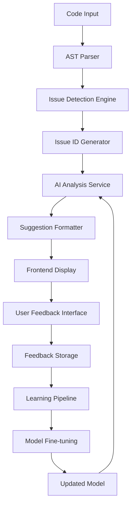

# Design Document

## Overview

The AST Feedback Pipeline is a comprehensive system that enhances the existing AI-powered code analysis by implementing Abstract Syntax Tree parsing, unique issue identification, user feedback collection, and model fine-tuning capabilities. The system builds upon the existing AIService and DirectAnalysis infrastructure to provide a learning mechanism that improves suggestion quality over time.

## Architecture

### High-Level Architecture



### Component Integration

The pipeline integrates with existing components:
- **AIService**: Enhanced to include issue IDs and feedback context
- **DirectAnalysis**: Extended to store AST metadata and issue tracking
- **Database Models**: New feedback and learning models added
- **API Endpoints**: New feedback endpoints and enhanced analysis endpoints

## Components and Interfaces

### 1. AST Parser Component

**Location**: `backend/app/utils/ast_parser.py`

**Responsibilities**:
- Parse code into Abstract Syntax Tree representation
- Extract code structure, patterns, and potential issues
- Generate contextual information for AI analysis

**Interface**:
```python
class ASTParser:
    def parse_code(self, code: str, language: str) -> ASTResult
    def extract_patterns(self, ast_result: ASTResult) -> List[CodePattern]
    def get_context_info(self, ast_result: ASTResult, line_number: int) -> ContextInfo
```

### 2. Issue ID Generator

**Location**: `backend/app/services/issue_id_service.py`

**Responsibilities**:
- Generate unique, deterministic IDs for code issues
- Maintain issue ID consistency across analysis runs
- Track issue lifecycle and relationships

**Interface**:
```python
class IssueIDService:
    def generate_issue_id(self, code_hash: str, pattern: str, location: dict) -> str
    def get_existing_issue_id(self, analysis_id: str, pattern: str) -> Optional[str]
    def track_issue_resolution(self, issue_id: str, status: str) -> None
```

### 3. Enhanced AI Service

**Location**: `backend/app/services/ai_service.py` (enhanced)

**Responsibilities**:
- Integrate AST context into AI prompts
- Include issue IDs in AI responses
- Track suggestion performance metrics

**Enhanced Interface**:
```python
class AIService:
    def get_review_for_code_with_ast(self, code: str, ast_context: ASTResult) -> List[EnhancedSuggestion]
    def format_suggestion_with_id(self, suggestion: dict, issue_id: str) -> EnhancedSuggestion
    def get_contextual_prompt(self, code: str, ast_patterns: List[CodePattern]) -> str
```

### 4. Feedback Collection Service

**Location**: `backend/app/services/feedback_service.py`

**Responsibilities**:
- Collect and validate user feedback
- Store feedback with contextual information
- Aggregate feedback for learning pipeline

**Interface**:
```python
class FeedbackService:
    def record_feedback(self, issue_id: str, user_id: int, feedback_type: str, context: dict) -> FeedbackRecord
    def get_feedback_statistics(self, time_range: DateRange) -> FeedbackStats
    def prepare_training_data(self, feedback_threshold: int) -> TrainingDataset
```

### 5. Learning Pipeline Service

**Location**: `backend/app/services/learning_service.py`

**Responsibilities**:
- Process feedback data for model training
- Coordinate fine-tuning operations
- Track model performance metrics

**Interface**:
```python
class LearningService:
    def process_feedback_batch(self, feedback_batch: List[FeedbackRecord]) -> ProcessingResult
    def trigger_fine_tuning(self, training_data: TrainingDataset) -> FineTuningJob
    def evaluate_model_performance(self, model_version: str) -> PerformanceMetrics
```

## Data Models

### 1. Enhanced DirectAnalysis Model

```python
class DirectAnalysis(Base):
    # Existing fields...
    
    # New AST-related fields
    ast_metadata = Column(JSON, nullable=True)  # AST parsing results
    code_patterns = Column(JSON, nullable=True)  # Detected patterns
    issue_ids = Column(JSON, nullable=True)  # Generated issue IDs
    ast_processing_time = Column(Float, nullable=True)  # Performance tracking
```

### 2. Issue Model

```python
class Issue(Base):
    __tablename__ = "issues"
    
    id = Column(String(64), primary_key=True)  # Deterministic hash-based ID
    analysis_id = Column(String(36), ForeignKey("direct_analyses.id"))
    pattern_type = Column(String(100), nullable=False)
    severity = Column(String(20), nullable=False)
    location = Column(JSON, nullable=False)  # Line, column, context
    suggestion_text = Column(Text, nullable=False)
    code_context = Column(Text, nullable=False)
    created_at = Column(DateTime, default=datetime.datetime.utcnow)
    
    # Relationships
    analysis = relationship("DirectAnalysis")
    feedback_records = relationship("FeedbackRecord", back_populates="issue")
```

### 3. FeedbackRecord Model

```python
class FeedbackRecord(Base):
    __tablename__ = "feedback_records"
    
    id = Column(Integer, primary_key=True)
    issue_id = Column(String(64), ForeignKey("issues.id"))
    user_id = Column(Integer, ForeignKey("users.id"))
    feedback_type = Column(String(20), nullable=False)  # accept, reject, modify
    feedback_value = Column(Integer, nullable=False)  # 1 for accept, -1 for reject
    feedback_comment = Column(Text, nullable=True)
    context_data = Column(JSON, nullable=True)  # Additional context
    created_at = Column(DateTime, default=datetime.datetime.utcnow)
    
    # Relationships
    issue = relationship("Issue", back_populates="feedback_records")
    user = relationship("User")
```

### 4. ModelVersion Model

```python
class ModelVersion(Base):
    __tablename__ = "model_versions"
    
    id = Column(Integer, primary_key=True)
    version_name = Column(String(100), unique=True, nullable=False)
    base_model = Column(String(100), nullable=False)
    training_data_size = Column(Integer, nullable=False)
    performance_metrics = Column(JSON, nullable=True)
    is_active = Column(Boolean, default=False)
    created_at = Column(DateTime, default=datetime.datetime.utcnow)
    fine_tuning_job_id = Column(String(255), nullable=True)
```

## Error Handling

### AST Parsing Errors
- **Syntax Errors**: Graceful fallback to basic text analysis
- **Unsupported Languages**: Clear error messages with supported language list
- **Large Files**: Implement chunking and timeout mechanisms

### Feedback Processing Errors
- **Invalid Feedback**: Validation with clear error messages
- **Duplicate Feedback**: Handle gracefully with update logic
- **Missing Context**: Request additional information from user

### Model Fine-tuning Errors
- **Insufficient Data**: Queue feedback until threshold is met
- **API Failures**: Retry logic with exponential backoff
- **Performance Degradation**: Automatic rollback to previous model version

## Testing Strategy

### Unit Tests
- **AST Parser**: Test parsing accuracy across different languages and code patterns
- **Issue ID Generation**: Verify uniqueness and deterministic behavior
- **Feedback Service**: Test validation, storage, and retrieval operations
- **Learning Pipeline**: Mock fine-tuning operations and test data processing

### Integration Tests
- **End-to-End Feedback Flow**: Submit code → receive suggestions → provide feedback → verify storage
- **Model Update Process**: Test complete learning pipeline with mock data
- **API Endpoint Integration**: Test new endpoints with existing authentication and validation

### Performance Tests
- **AST Processing Speed**: Benchmark parsing times for various file sizes
- **Feedback Query Performance**: Test database queries under load
- **Memory Usage**: Monitor memory consumption during AST processing

### User Acceptance Tests
- **Feedback UI Usability**: Test feedback interface with real users
- **Suggestion Quality**: A/B test model improvements
- **Learning Effectiveness**: Track suggestion acceptance rates over time

## Security Considerations

### Data Privacy
- **Code Content**: Ensure secure storage and transmission of user code
- **Feedback Data**: Anonymize feedback data for model training
- **Model Access**: Restrict fine-tuning operations to authorized users

### API Security
- **Authentication**: Require valid tokens for feedback submission
- **Rate Limiting**: Prevent abuse of feedback and analysis endpoints
- **Input Validation**: Sanitize all user inputs to prevent injection attacks

### Model Security
- **Training Data**: Validate training data to prevent model poisoning
- **Version Control**: Maintain audit trail of model changes
- **Rollback Capability**: Ensure ability to revert to previous model versions

## Performance Optimization

### AST Processing
- **Caching**: Cache AST results for identical code snippets
- **Parallel Processing**: Process multiple files concurrently
- **Incremental Analysis**: Only re-analyze changed code sections

### Feedback Aggregation
- **Batch Processing**: Process feedback in batches for efficiency
- **Background Jobs**: Use task queues for non-blocking operations
- **Data Compression**: Compress stored AST and feedback data

### Model Training
- **Incremental Learning**: Support continuous model updates
- **Resource Management**: Monitor and limit training resource usage
- **Distributed Training**: Scale training across multiple instances if needed