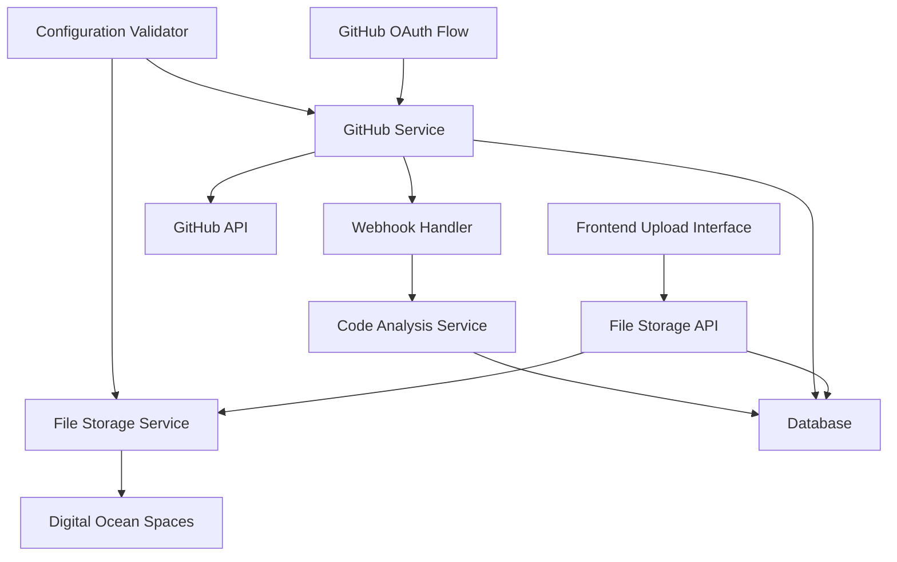

# Design Document

## Overview

This design addresses three critical integration components: fixing Digital Ocean Spaces file uploads, enhancing multiple file upload capabilities, and completing GitHub integration setup. The solution focuses on configuration corrections, API enhancements, and robust error handling while maintaining existing functionality.

## Architecture

### System Components



### Key Design Principles

1. **Configuration-First Approach**: Validate all configurations before service initialization
2. **Graceful Degradation**: Handle partial failures in batch operations
3. **Security by Design**: Proper authentication, signature verification, and access controls
4. **Observability**: Comprehensive logging and error reporting
5. **Scalability**: Support for concurrent operations and rate limiting

## Components and Interfaces

### 1. Digital Ocean Spaces Configuration Fix

**Problem Identified**: The current endpoint URL includes the bucket name, which is incorrect for boto3 S3 client.

**Current (Incorrect)**:

```
DO_SPACES_ENDPOINT=https://codenova-uploads.blr1.digitaloceanspaces.com
```

**Corrected Configuration**:

```
DO_SPACES_ENDPOINT=https://blr1.digitaloceanspaces.com
DO_SPACES_REGION=blr1  # lowercase
```

**Configuration Validator**:

```python
class ConfigurationValidator:
    def validate_spaces_config(self) -> ValidationResult:
        # Validate endpoint format
        # Test connectivity
        # Verify bucket access
        # Return detailed validation results
```

### 2. Enhanced File Storage Service

**Multiple File Upload Enhancement**:

```python
class FileStorageService:
    async def upload_multiple_files(
        self,
        files: List[UploadFile],
        user: User,
        db: Session,
        metadata: Optional[Dict] = None
    ) -> MultipleFileUploadResult:
        # Process files concurrently with error isolation
        # Maintain transaction consistency
        # Return detailed results per file
```

**Batch Processing Strategy**:

- Process files concurrently using asyncio.gather with exception handling
- Implement file-level transaction isolation
- Provide detailed success/failure reporting
- Enforce batch size limits (max 10 files)

### 3. GitHub Integration Service

**OAuth Flow Enhancement**:

```python
class GitHubOAuthService:
    async def initiate_oauth(self, user_id: int, state: str) -> str:
        # Generate secure state parameter
        # Create authorization URL with proper scopes
        # Store state for verification

    async def handle_oauth_callback(self, code: str, state: str) -> OAuthResult:
        # Verify state parameter
        # Exchange code for access token
        # Store encrypted token
        # Fetch user GitHub profile
```

**Webhook Processing**:

```python
class GitHubWebhookHandler:
    async def process_webhook(self, headers: Dict, payload: bytes) -> WebhookResult:
        # Verify signature using HMAC-SHA256
        # Parse event type and payload
        # Route to appropriate handler
        # Return processing status
```

### 4. Configuration Management

**Environment Configuration**:

```python
class IntegrationConfig:
    # Digital Ocean Spaces
    spaces_key: str
    spaces_secret: str
    spaces_bucket: str
    spaces_region: str
    spaces_endpoint: str

    # GitHub Integration
    github_client_id: str
    github_client_secret: str
    github_app_id: Optional[str]
    github_private_key: Optional[str]
    github_webhook_secret: str

    def validate(self) -> List[ValidationError]:
        # Comprehensive validation logic
```

## Data Models

### Enhanced File Storage Models

```python
class StoredFile(Base):
    # Existing fields...
    batch_id: Optional[str]  # For grouping multiple uploads
    upload_metadata: JSON    # Store additional metadata
    processing_status: Enum  # PENDING, PROCESSING, COMPLETED, FAILED

class FileUploadBatch(Base):
    id: str = Field(primary_key=True)
    user_id: int
    total_files: int
    successful_uploads: int
    failed_uploads: int
    created_at: datetime
    completed_at: Optional[datetime]
```

### GitHub Integration Models

```python
class GitHubIntegration(Base):
    id: str = Field(primary_key=True)
    user_id: int
    github_user_id: int
    github_username: str
    access_token: str  # Encrypted
    token_expires_at: Optional[datetime]
    scopes: List[str]
    created_at: datetime

class GitHubRepository(Base):
    # Enhanced existing model
    integration_id: str  # Foreign key to GitHubIntegration
    webhook_config: JSON
    analysis_settings: JSON
```

## Error Handling

### Digital Ocean Spaces Error Handling

```python
class SpacesErrorHandler:
    def handle_upload_error(self, error: Exception) -> FileStorageError:
        if isinstance(error, ClientError):
            error_code = error.response['Error']['Code']
            if error_code == 'InvalidAccessKeyId':
                return FileStorageError("Invalid access credentials", "AUTH_ERROR")
            elif error_code == 'NoSuchBucket':
                return FileStorageError("Bucket not found", "BUCKET_ERROR")
        return FileStorageError("Upload failed", "UPLOAD_ERROR")
```

### GitHub API Error Handling

```python
class GitHubErrorHandler:
    def handle_api_error(self, error: GithubException) -> GitHubIntegrationError:
        if error.status == 401:
            return GitHubIntegrationError("Invalid credentials", "AUTH_ERROR")
        elif error.status == 403:
            if 'rate limit' in str(error).lower():
                return GitHubIntegrationError("Rate limit exceeded", "RATE_LIMIT")
            return GitHubIntegrationError("Access forbidden", "ACCESS_ERROR")
        elif error.status == 404:
            return GitHubIntegrationError("Resource not found", "NOT_FOUND")
        return GitHubIntegrationError("GitHub API error", "API_ERROR")
```

## Testing Strategy

### Configuration Testing

1. **Spaces Configuration Test**:

   - Validate environment variables
   - Test bucket connectivity
   - Verify upload/download operations
   - Test signed URL generation

2. **GitHub Configuration Test**:
   - Validate OAuth credentials
   - Test API connectivity
   - Verify webhook signature validation

### Integration Testing

1. **File Upload Testing**:

   - Single file upload
   - Multiple file upload (success/partial failure scenarios)
   - Large file handling
   - Error condition testing

2. **GitHub Integration Testing**:
   - OAuth flow end-to-end
   - Webhook processing
   - Repository connection
   - PR analysis workflow

### Performance Testing

1. **Concurrent Upload Testing**:

   - Multiple users uploading simultaneously
   - Large batch uploads
   - Memory usage monitoring

2. **GitHub API Rate Limiting**:
   - Rate limit handling
   - Exponential backoff testing
   - Webhook processing under load

## Security Considerations

### File Storage Security

1. **Access Control**:

   - User-based file isolation
   - Signed URL expiration
   - File type validation

2. **Data Protection**:
   - File content scanning
   - Metadata sanitization
   - Secure deletion

### GitHub Integration Security

1. **OAuth Security**:

   - State parameter validation
   - Token encryption at rest
   - Scope limitation

2. **Webhook Security**:
   - HMAC signature verification
   - Payload size limits
   - Request rate limiting

## Implementation Phases

### Phase 1: Configuration Fix and Validation

- Fix Digital Ocean Spaces endpoint configuration
- Implement configuration validation service
- Create health check endpoints

### Phase 2: Multiple File Upload Enhancement

- Enhance file storage service for batch processing
- Update API endpoints
- Add batch tracking and reporting

### Phase 3: GitHub Integration Completion

- Complete OAuth flow implementation
- Set up webhook processing
- Implement repository connection workflow

### Phase 4: Testing and Monitoring

- Comprehensive test suite
- Performance monitoring
- Error tracking and alerting

## Monitoring and Observability

### Metrics to Track

1. **File Storage Metrics**:

   - Upload success/failure rates
   - File processing times
   - Storage usage per user
   - API response times

2. **GitHub Integration Metrics**:
   - OAuth success rates
   - Webhook processing times
   - API rate limit usage
   - Analysis completion rates

### Logging Strategy

1. **Structured Logging**:

   - JSON format for all logs
   - Correlation IDs for request tracking
   - Error context preservation

2. **Log Levels**:
   - DEBUG: Detailed operation traces
   - INFO: Successful operations
   - WARN: Recoverable errors
   - ERROR: Operation failures
   - CRITICAL: System-level issues
