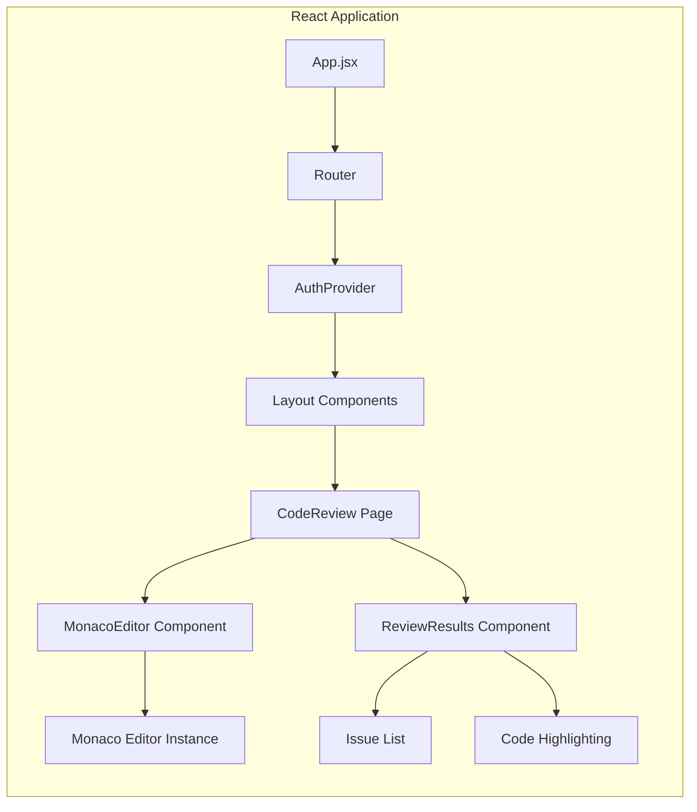

# Design Document

## Overview

This design outlines the integration of the React frontend with the FastAPI backend, implementing Monaco Editor for enhanced code editing, and establishing robust API communication patterns. The solution will transform the current basic textarea-based code editor into a professional IDE-like experience while ensuring seamless data flow between frontend and backend services.

The architecture follows a modern web application pattern with React handling the user interface, Monaco Editor providing advanced code editing capabilities, and FastAPI serving as the backend API with AI-powered code analysis. Authentication will be handled through JWT tokens, and the application will support real-time feedback and responsive design.

## Architecture

### High-Level Architecture

```mermaid
graph TB
    subgraph "Frontend (React + Vite)"
        A[React Router] --> B[Authentication Context]
        B --> C[Page Components]
        C --> D[Monaco Editor Component]
        C --> E[API Service Layer]
        E --> F[HTTP Client (Axios)]
    end
    
    subgraph "Backend (FastAPI)"
        G[FastAPI Main App] --> H[CORS Middleware]
        H --> I[Authentication Middleware]
        I --> J[API Router v1]
        J --> K[Analysis Endpoints]
        J --> L[Auth Endpoints]
        K --> M[AI Service]
        L --> N[Auth Service]
    end
    
    F --> G
    M --> O[Gemini AI API]
    N --> P[PostgreSQL Database]
    K --> P
```

### Component Architecture



## Components and Interfaces

### Frontend Components

#### 1. Enhanced Monaco Editor Component

**Location:** `frontend/components/MonacoEditor.jsx`

**Props Interface:**
```typescript
interface MonacoEditorProps {
  value: string;
  onChange: (value: string) => void;
  language: string;
  theme?: 'vs-dark' | 'vs-light';
  height?: string;
  readOnly?: boolean;
  onMount?: (editor: monaco.editor.IStandaloneCodeEditor) => void;
  markers?: monaco.editor.IMarkerData[];
}
```

**Key Features:**
- Syntax highlighting for multiple programming languages
- Auto-completion and IntelliSense
- Error and warning markers
- Code folding and minimap
- Find and replace functionality
- Responsive design with configurable height

#### 2. API Service Layer

**Location:** `frontend/services/apiService.js`

**Interface:**
```typescript
interface ApiService {
  // Authentication
  login(credentials: LoginCredentials): Promise<AuthResponse>;
  register(userData: RegisterData): Promise<AuthResponse>;
  refreshToken(): Promise<TokenResponse>;
  logout(): Promise<void>;
  
  // Code Analysis
  analyzeCode(codeData: CodeAnalysisRequest): Promise<AnalysisResponse>;
  getAnalysisById(id: number): Promise<Analysis>;
  getAnalysesByRepo(repoId: number): Promise<Analysis[]>;
  
  // File Upload
  uploadFile(file: File): Promise<FileUploadResponse>;
}
```

#### 3. Authentication Context

**Location:** `frontend/contexts/AuthContext.jsx`

**State Interface:**
```typescript
interface AuthState {
  user: User | null;
  token: string | null;
  isAuthenticated: boolean;
  isLoading: boolean;
}

interface AuthContextValue extends AuthState {
  login: (credentials: LoginCredentials) => Promise<void>;
  register: (userData: RegisterData) => Promise<void>;
  logout: () => void;
  refreshToken: () => Promise<void>;
}
```

#### 4. Enhanced CodeReview Page

**Location:** `frontend/pages/CodeReview.jsx`

**State Management:**
```typescript
interface CodeReviewState {
  code: string;
  language: string;
  isAnalyzing: boolean;
  analysisResults: AnalysisResult[];
  selectedTab: 'editor' | 'upload' | 'git';
  editorInstance: monaco.editor.IStandaloneCodeEditor | null;
  markers: monaco.editor.IMarkerData[];
}
```

### Backend Enhancements

#### 1. Code Analysis Endpoint Enhancement

**Location:** `backend/app/api/v1/endpoints/analysis.py`

**New Endpoint:**
```python
@router.post("/analyze-code", response_model=CodeAnalysisResponse)
def analyze_code_direct(
    request: DirectCodeAnalysisRequest,
    current_user: User = Depends(get_current_active_user),
    db: Session = Depends(get_db)
):
    """Analyze code directly without repository context."""
```

**Request/Response Models:**
```python
class DirectCodeAnalysisRequest(BaseModel):
    code: str = Field(min_length=1, max_length=100000)
    language: str = Field(default="javascript")
    filename: Optional[str] = None

class CodeAnalysisResponse(BaseModel):
    analysis_id: str
    status: str
    issues: List[CodeIssue]
    metrics: CodeMetrics
    suggestions: List[CodeSuggestion]

class CodeIssue(BaseModel):
    line: int
    column: int
    severity: str  # "error", "warning", "info"
    message: str
    rule: str
    suggestion: Optional[str] = None
```

#### 2. File Upload Endpoint

**Location:** `backend/app/api/v1/endpoints/files.py`

```python
@router.post("/upload", response_model=FileUploadResponse)
async def upload_file(
    file: UploadFile = File(...),
    current_user: User = Depends(get_current_active_user)
):
    """Upload and process code files."""
```

## Data Models

### Frontend Data Models

#### Analysis Result Model
```typescript
interface AnalysisResult {
  id: string;
  status: 'pending' | 'completed' | 'failed';
  issues: CodeIssue[];
  metrics: {
    linesOfCode: number;
    complexity: number;
    maintainabilityIndex: number;
  };
  createdAt: string;
  completedAt?: string;
}

interface CodeIssue {
  line: number;
  column: number;
  severity: 'error' | 'warning' | 'info';
  message: string;
  rule: string;
  suggestion?: string;
}
```

#### File Upload Model
```typescript
interface FileUploadData {
  file: File;
  language?: string;
}

interface FileUploadResponse {
  filename: string;
  content: string;
  language: string;
  size: number;
}
```

### Backend Data Models

#### Enhanced Analysis Model
```python
class DirectAnalysis(Base):
    __tablename__ = "direct_analyses"
    
    id = Column(String, primary_key=True, default=lambda: str(uuid.uuid4()))
    user_id = Column(Integer, ForeignKey("users.id"), nullable=False)
    code_content = Column(Text, nullable=False)
    language = Column(String(50), nullable=False)
    filename = Column(String(255), nullable=True)
    status = Column(String(20), default="pending")
    results = Column(JSON, nullable=True)
    created_at = Column(DateTime, default=datetime.utcnow)
    completed_at = Column(DateTime, nullable=True)
```

## Error Handling

### Frontend Error Handling

#### API Error Interceptor
```typescript
// Axios interceptor for handling API errors
axios.interceptors.response.use(
  (response) => response,
  (error) => {
    if (error.response?.status === 401) {
      // Handle authentication errors
      authContext.logout();
      navigate('/login');
    } else if (error.response?.status >= 500) {
      // Handle server errors
      showErrorNotification('Server error occurred');
    }
    return Promise.reject(error);
  }
);
```

#### Component Error Boundaries
```typescript
class CodeEditorErrorBoundary extends React.Component {
  constructor(props) {
    super(props);
    this.state = { hasError: false, error: null };
  }

  static getDerivedStateFromError(error) {
    return { hasError: true, error };
  }

  componentDidCatch(error, errorInfo) {
    console.error('Monaco Editor Error:', error, errorInfo);
  }

  render() {
    if (this.state.hasError) {
      return <FallbackEditor {...this.props} />;
    }
    return this.props.children;
  }
}
```

### Backend Error Handling

#### Custom Exception Classes
```python
class CodeAnalysisError(HTTPException):
    def __init__(self, detail: str):
        super().__init__(status_code=422, detail=detail)

class FileProcessingError(HTTPException):
    def __init__(self, detail: str):
        super().__init__(status_code=400, detail=detail)
```

#### Global Exception Handler
```python
@app.exception_handler(CodeAnalysisError)
async def code_analysis_exception_handler(request: Request, exc: CodeAnalysisError):
    return JSONResponse(
        status_code=exc.status_code,
        content={"detail": exc.detail, "type": "code_analysis_error"}
    )
```

## Testing Strategy

### Frontend Testing

#### Unit Tests
- **Monaco Editor Component**: Test editor initialization, language switching, value changes
- **API Service**: Mock HTTP requests and test error handling
- **Authentication Context**: Test login/logout flows and token management
- **Code Review Page**: Test state management and user interactions

#### Integration Tests
- **API Integration**: Test actual API calls with mock backend
- **File Upload Flow**: Test file selection, upload, and content loading
- **Authentication Flow**: Test complete login/logout cycle

#### E2E Tests
- **Complete Code Review Workflow**: From login to code analysis results
- **File Upload and Analysis**: Upload file, analyze, view results
- **Responsive Design**: Test on different screen sizes

### Backend Testing

#### Unit Tests
- **Analysis Service**: Test code analysis logic and AI service integration
- **Authentication Service**: Test JWT token creation and validation
- **File Processing**: Test file upload and content extraction

#### Integration Tests
- **API Endpoints**: Test all endpoints with various input scenarios
- **Database Operations**: Test CRUD operations for all models
- **AI Service Integration**: Test Gemini API integration with mock responses

#### Performance Tests
- **Code Analysis Performance**: Test with large code files
- **Concurrent Requests**: Test multiple simultaneous analysis requests
- **File Upload Limits**: Test file size and type restrictions

### Testing Tools and Configuration

#### Frontend Testing Stack
```json
{
  "devDependencies": {
    "@testing-library/react": "^13.4.0",
    "@testing-library/jest-dom": "^5.16.5",
    "@testing-library/user-event": "^14.4.3",
    "jest": "^29.3.1",
    "cypress": "^12.3.0",
    "msw": "^0.49.2"
  }
}
```

#### Backend Testing Stack
```python
# requirements-test.txt
pytest==7.2.0
pytest-asyncio==0.20.3
httpx==0.23.3
pytest-mock==3.10.0
factory-boy==3.2.1
```

### Test Data Management

#### Mock Data for Frontend
```typescript
// Mock analysis results for testing
export const mockAnalysisResult: AnalysisResult = {
  id: 'test-analysis-1',
  status: 'completed',
  issues: [
    {
      line: 5,
      column: 10,
      severity: 'warning',
      message: 'Variable is declared but never used',
      rule: 'no-unused-vars',
      suggestion: 'Remove unused variable or use it in the code'
    }
  ],
  metrics: {
    linesOfCode: 25,
    complexity: 3,
    maintainabilityIndex: 85
  },
  createdAt: '2024-01-01T10:00:00Z',
  completedAt: '2024-01-01T10:00:05Z'
};
```

#### Test Fixtures for Backend
```python
# conftest.py
@pytest.fixture
def sample_code():
    return """
    function calculateSum(a, b) {
        const result = a + b;
        return result;
    }
    """

@pytest.fixture
def mock_analysis_response():
    return {
        "issues": [
            {
                "line": 2,
                "column": 11,
                "severity": "info",
                "message": "Consider using arrow function",
                "rule": "prefer-arrow-callback"
            }
        ],
        "metrics": {
            "lines_of_code": 4,
            "complexity": 1,
            "maintainability_index": 95
        }
    }
```