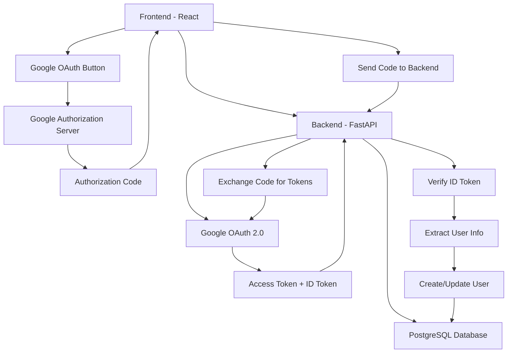

# Google OAuth Implementation Guide

## 📋 Overview

This document outlines the complete implementation of Google OAuth authentication for the CodeNova application, providing users with the ability to sign in using their Google accounts alongside the existing email/password authentication.

## 🎯 Goals

- **Seamless Integration**: Add Google OAuth without disrupting existing authentication
- **User Experience**: Provide a smooth "Sign in with Google" experience
- **Security**: Implement OAuth 2.0 best practices
- **Flexibility**: Support both OAuth and traditional authentication methods
- **Data Consistency**: Properly handle user data from Google accounts

## 🏗️ Architecture Overview



## 🔧 Implementation Plan

### Phase 1: Backend Implementation
1. **Google OAuth Configuration**
   - Set up Google Cloud Console project
   - Configure OAuth 2.0 credentials
   - Add environment variables

2. **Backend Dependencies**
   - Install required OAuth libraries
   - Update requirements.txt

3. **Database Schema Updates**
   - Add OAuth provider fields to User model
   - Create migration scripts

4. **OAuth Endpoints**
   - Create Google OAuth callback endpoint
   - Implement token exchange logic
   - Add user creation/linking logic

5. **Security & Validation**
   - Implement ID token verification
   - Add CSRF protection
   - Validate OAuth state parameter

### Phase 2: Frontend Implementation
1. **Google OAuth Library**
   - Install Google OAuth library
   - Configure OAuth client

2. **UI Components**
   - Create "Sign in with Google" button
   - Add OAuth loading states
   - Handle OAuth errors

3. **Authentication Flow**
   - Implement OAuth redirect handling
   - Update AuthContext for OAuth
   - Handle OAuth callbacks

4. **User Experience**
   - Add OAuth to login/register pages
   - Handle account linking scenarios
   - Provide fallback options

### Phase 3: Testing & Security
1. **Unit Tests**
   - Test OAuth endpoints
   - Test frontend OAuth flow
   - Mock Google OAuth responses

2. **Integration Tests**
   - End-to-end OAuth flow testing
   - Error scenario testing
   - Security validation

3. **Security Audit**
   - Review OAuth implementation
   - Validate token handling
   - Check for security vulnerabilities

## 📦 Dependencies

### Backend Dependencies
```python
# OAuth & JWT
google-auth==2.35.0
google-auth-oauthlib==1.2.1
google-auth-httplib2==0.2.0
authlib==1.4.0
python-jose[cryptography]==3.3.0

# HTTP Client
httpx==0.28.1
requests==2.32.3
```

### Frontend Dependencies
```json
{
  "@google-cloud/local-auth": "^3.0.1",
  "google-auth-library": "^9.14.1",
  "react-google-login": "^5.2.2",
  "@react-oauth/google": "^0.12.1"
}
```

## 🔐 Security Considerations

### 1. **OAuth 2.0 Security Best Practices**
- Use PKCE (Proof Key for Code Exchange) for public clients
- Implement proper state parameter validation
- Use secure redirect URIs (HTTPS only in production)
- Validate ID tokens properly
- Implement proper session management

### 2. **Token Security**
- Store tokens securely (httpOnly cookies for refresh tokens)
- Implement proper token rotation
- Use short-lived access tokens
- Validate token signatures and claims

### 3. **User Data Protection**
- Minimal data collection from Google
- Proper consent handling
- GDPR compliance considerations
- Data retention policies

## 🗄️ Database Schema Changes

### User Model Updates
```python
class User(Base):
    __tablename__ = "users"
    
    # Existing fields
    id = Column(Integer, primary_key=True, index=True)
    email = Column(String, unique=True, index=True, nullable=False)
    full_name = Column(String, nullable=False)
    hashed_password = Column(String, nullable=True)  # Make nullable for OAuth users
    
    # New OAuth fields
    oauth_provider = Column(String, nullable=True)  # 'google', 'github', etc.
    oauth_id = Column(String, nullable=True)  # Provider-specific user ID
    oauth_email_verified = Column(Boolean, default=False)
    profile_picture_url = Column(String, nullable=True)
    
    # Metadata
    created_at = Column(DateTime, default=datetime.utcnow)
    updated_at = Column(DateTime, default=datetime.utcnow, onupdate=datetime.utcnow)
    last_login = Column(DateTime, nullable=True)
    
    # Constraints
    __table_args__ = (
        UniqueConstraint('oauth_provider', 'oauth_id', name='unique_oauth_user'),
    )
```

### Migration Script
```python
"""Add OAuth fields to users table

Revision ID: add_oauth_fields
Revises: previous_revision
Create Date: 2024-01-XX XX:XX:XX.XXXXXX
"""

from alembic import op
import sqlalchemy as sa

def upgrade():
    # Add OAuth fields
    op.add_column('users', sa.Column('oauth_provider', sa.String(), nullable=True))
    op.add_column('users', sa.Column('oauth_id', sa.String(), nullable=True))
    op.add_column('users', sa.Column('oauth_email_verified', sa.Boolean(), default=False))
    op.add_column('users', sa.Column('profile_picture_url', sa.String(), nullable=True))
    op.add_column('users', sa.Column('last_login', sa.DateTime(), nullable=True))
    
    # Make password nullable for OAuth users
    op.alter_column('users', 'hashed_password', nullable=True)
    
    # Add unique constraint for OAuth users
    op.create_unique_constraint('unique_oauth_user', 'users', ['oauth_provider', 'oauth_id'])

def downgrade():
    op.drop_constraint('unique_oauth_user', 'users', type_='unique')
    op.drop_column('users', 'last_login')
    op.drop_column('users', 'profile_picture_url')
    op.drop_column('users', 'oauth_email_verified')
    op.drop_column('users', 'oauth_id')
    op.drop_column('users', 'oauth_provider')
    op.alter_column('users', 'hashed_password', nullable=False)
```

## 🔗 API Endpoints

### 1. **Google OAuth Initiation**
```python
@router.get("/auth/google")
async def google_oauth_login(request: Request):
    """Initiate Google OAuth flow"""
    # Generate state parameter for CSRF protection
    # Redirect to Google OAuth authorization URL
```

### 2. **Google OAuth Callback**
```python
@router.get("/auth/google/callback")
async def google_oauth_callback(
    code: str,
    state: str,
    db: Session = Depends(get_db)
):
    """Handle Google OAuth callback"""
    # Validate state parameter
    # Exchange authorization code for tokens
    # Verify ID token
    # Create or update user
    # Return JWT tokens
```

### 3. **Link Google Account**
```python
@router.post("/auth/link-google")
async def link_google_account(
    google_token: str,
    current_user: User = Depends(get_current_user),
    db: Session = Depends(get_db)
):
    """Link Google account to existing user"""
    # Verify Google token
    # Link Google account to current user
    # Update user profile with Google data
```

## 🎨 Frontend Components

### 1. **Google OAuth Button Component**
```jsx
// components/auth/GoogleOAuthButton.jsx
import { GoogleLogin } from '@react-oauth/google';

const GoogleOAuthButton = ({ onSuccess, onError, disabled = false }) => {
  return (
    <GoogleLogin
      onSuccess={onSuccess}
      onError={onError}
      disabled={disabled}
      theme="outline"
      size="large"
      text="signin_with"
      shape="rectangular"
    />
  );
};
```

### 2. **OAuth Integration in AuthContext**
```jsx
// contexts/AuthContext.jsx
const AuthProvider = ({ children }) => {
  // ... existing code

  const loginWithGoogle = async (credentialResponse) => {
    try {
      setIsLoading(true);
      const result = await authService.loginWithGoogle(credentialResponse);
      setUser(result.user);
      setToken(result.token);
      setIsAuthenticated(true);
      showSuccess(`Welcome, ${result.user.full_name}!`);
      return result;
    } catch (error) {
      showError(error.message || 'Google login failed');
      throw error;
    } finally {
      setIsLoading(false);
    }
  };

  // ... rest of context
};
```

### 3. **Updated Login Page**
```jsx
// pages/Login.jsx
const Login = () => {
  return (
    <div className="login-container">
      <h1>Sign In to CodeNova</h1>
      
      {/* Google OAuth Button */}
      <GoogleOAuthButton
        onSuccess={handleGoogleSuccess}
        onError={handleGoogleError}
        disabled={isLoading}
      />
      
      <div className="divider">
        <span>or</span>
      </div>
      
      {/* Traditional Login Form */}
      <LoginForm onSubmit={handleEmailLogin} />
    </div>
  );
};
```

## 🧪 Testing Strategy

### 1. **Backend Tests**
```python
# tests/test_oauth.py
class TestGoogleOAuth:
    def test_google_oauth_callback_success(self):
        """Test successful Google OAuth callback"""
        # Mock Google token verification
        # Test user creation/update
        # Verify JWT token generation
    
    def test_google_oauth_callback_invalid_token(self):
        """Test OAuth callback with invalid token"""
        # Mock invalid token response
        # Verify proper error handling
    
    def test_link_google_account(self):
        """Test linking Google account to existing user"""
        # Create existing user
        # Mock Google token verification
        # Test account linking
```

### 2. **Frontend Tests**
```jsx
// __tests__/GoogleOAuth.test.jsx
describe('Google OAuth Integration', () => {
  it('should handle successful Google login', async () => {
    // Mock Google OAuth response
    // Test AuthContext integration
    // Verify user state updates
  });

  it('should handle Google login errors', async () => {
    // Mock Google OAuth error
    // Test error handling
    // Verify error messages
  });

  it('should display Google OAuth button', () => {
    // Test component rendering
    // Verify button properties
  });
});
```

## 🔧 Configuration

### 1. **Google Cloud Console Setup - Detailed Steps**

#### Step 1: Create or Select Google Cloud Project
1. **Go to Google Cloud Console**
   - Visit [Google Cloud Console](https://console.cloud.google.com/)
   - Sign in with your Google account

2. **Create New Project** (or select existing)
   - Click on the project dropdown at the top
   - Click "New Project"
   - Enter project name: `codenova-oauth` (or your preferred name)
   - Select your organization (if applicable)
   - Click "Create"
   - Wait for project creation to complete

3. **Select Your Project**
   - Ensure your new project is selected in the project dropdown

#### Step 2: Enable Required APIs
1. **Navigate to APIs & Services**
   - In the left sidebar, click "APIs & Services" → "Library"
   - Or use the search bar to find "APIs & Services"

2. **Enable Google Identity Services API**
   - Search for "Google Identity Services API"
   - Click on it and press "Enable"
   - Wait for activation

3. **Enable Google+ API** (Optional but recommended)
   - Search for "Google+ API"
   - Click on it and press "Enable"

#### Step 3: Configure OAuth Consent Screen
1. **Go to OAuth Consent Screen**
   - Navigate to "APIs & Services" → "OAuth consent screen"

2. **Choose User Type**
   - Select "External" (for public applications)
   - Click "Create"

3. **Fill App Information**
   ```
   App name: CodeNova AI
   User support email: your-email@example.com
   App logo: (Optional - upload your app logo)
   App domain: http://localhost:3000 (for development)
   Application home page: http://localhost:3000
   Application privacy policy link: http://localhost:3000/privacy (create this page)
   Application terms of service link: http://localhost:3000/terms (create this page)
   ```

4. **Authorized Domains**
   - Add your domains:
     ```
     localhost (for development)
     yourdomain.com (for production)
     ```

5. **Developer Contact Information**
   - Add your email address
   - Click "Save and Continue"

6. **Scopes Configuration**
   - Click "Add or Remove Scopes"
   - Add these scopes:
     ```
     ../auth/userinfo.email
     ../auth/userinfo.profile
     openid
     ```
   - Click "Update" then "Save and Continue"

7. **Test Users** (for development)
   - Add test user emails that can access your app during development
   - Add your email and any team member emails
   - Click "Save and Continue"

8. **Summary**
   - Review all information
   - Click "Back to Dashboard"

#### Step 4: Create OAuth 2.0 Credentials
1. **Navigate to Credentials**
   - Go to "APIs & Services" → "Credentials"

2. **Create Credentials**
   - Click "Create Credentials" → "OAuth client ID"

3. **Configure OAuth Client**
   - **Application type**: Web application
   - **Name**: `CodeNova OAuth Client`

4. **Authorized JavaScript Origins**
   ```
   Development:
   http://localhost:3000
   http://localhost:5173
   http://127.0.0.1:3000
   http://127.0.0.1:5173

   Production (add when ready):
   https://yourdomain.com
   https://www.yourdomain.com
   ```

5. **Authorized Redirect URIs**
   ```
   Development:
   http://localhost:8000/api/v1/auth/google/callback
   http://localhost:3000/auth/callback
   http://localhost:5173/auth/callback

   Production (add when ready):
   https://yourdomain.com/api/v1/auth/google/callback
   https://yourdomain.com/auth/callback
   ```

6. **Create Client**
   - Click "Create"
   - **IMPORTANT**: Copy and save the Client ID and Client Secret immediately

#### Step 5: Download Credentials (Optional)
1. **Download JSON**
   - Click the download icon next to your OAuth client
   - Save the JSON file securely (don't commit to version control)
   - This contains your client ID and secret

#### Step 6: Configure for Production (Later)
1. **Update Authorized Domains**
   - Add your production domain to OAuth consent screen
   - Update authorized origins and redirect URIs
   - Submit for verification if needed (for public apps)

### 📋 **Credentials Summary**
After completing the setup, you'll have:

```bash
# Your OAuth Credentials
GOOGLE_CLIENT_ID=123456789-abcdefghijklmnop.apps.googleusercontent.com
GOOGLE_CLIENT_SECRET=GOCSPX-abcdefghijklmnopqrstuvwxyz
```

### 🔗 **Callback URLs Reference**
```bash
# Development URLs
Backend Callback:  http://localhost:8000/api/v1/auth/google/callback
Frontend Callback: http://localhost:3000/auth/callback

# Production URLs (update when deploying)
Backend Callback:  https://api.yourdomain.com/api/v1/auth/google/callback
Frontend Callback: https://yourdomain.com/auth/callback
```

### ⚠️ **Important Security Notes**
1. **Never commit credentials to version control**
2. **Use environment variables for all credentials**
3. **Restrict authorized domains in production**
4. **Regularly rotate client secrets**
5. **Monitor OAuth usage in Google Cloud Console**

### 🔧 **Testing Your Setup**
1. **Verify Credentials**
   - Go to "APIs & Services" → "Credentials"
   - Click on your OAuth client
   - Verify all URLs are correct

2. **Test OAuth Flow**
   - Use Google's OAuth Playground: https://developers.google.com/oauthplayground/
   - Enter your client ID
   - Test the authorization flow

### 📱 **Mobile App Setup** (Future)
If you plan to add mobile apps later:
1. Create additional OAuth clients for iOS/Android
2. Add bundle IDs and package names
3. Configure mobile-specific redirect schemes

### 2. **Environment Variables**
```bash
# Backend (.env)
GOOGLE_CLIENT_ID=your_google_client_id
GOOGLE_CLIENT_SECRET=your_google_client_secret
GOOGLE_REDIRECT_URI=http://localhost:8000/api/v1/auth/google/callback

# Frontend (.env)
VITE_GOOGLE_CLIENT_ID=your_google_client_id
VITE_API_BASE_URL=http://localhost:8000/api/v1
```

### 3. **OAuth Configuration**
```python
# backend/app/core/config.py
class Settings(BaseSettings):
    # ... existing settings
    
    # Google OAuth
    GOOGLE_CLIENT_ID: str
    GOOGLE_CLIENT_SECRET: str
    GOOGLE_REDIRECT_URI: str = "http://localhost:8000/api/v1/auth/google/callback"
    
    class Config:
        env_file = ".env"
```

## 🚀 Deployment Considerations

### 1. **Production Configuration**
- Use HTTPS for all OAuth redirects
- Configure proper CORS settings
- Set secure cookie flags
- Use environment-specific redirect URIs

### 2. **Security Checklist**
- [ ] HTTPS enabled in production
- [ ] Secure cookie configuration
- [ ] CORS properly configured
- [ ] OAuth redirect URIs validated
- [ ] State parameter validation implemented
- [ ] ID token signature verification
- [ ] Rate limiting on OAuth endpoints
- [ ] Proper error handling (no sensitive data in errors)

### 3. **Monitoring & Logging**
- Log OAuth authentication attempts
- Monitor OAuth error rates
- Track user registration sources
- Set up alerts for OAuth failures

## 📈 Success Metrics

### 1. **User Experience Metrics**
- OAuth conversion rate
- Time to complete OAuth flow
- OAuth error rates
- User preference (OAuth vs traditional)

### 2. **Technical Metrics**
- OAuth endpoint response times
- Token validation success rates
- Database query performance
- Error handling effectiveness

## 🔄 Migration Strategy

### 1. **Existing Users**
- Provide option to link Google account
- Maintain existing authentication methods
- Gradual migration approach
- Clear communication about benefits

### 2. **Data Migration**
- No immediate data migration required
- Optional profile enhancement from Google data
- Preserve existing user preferences
- Maintain data consistency

## 📚 Resources & References

### 1. **Documentation**
- [Google OAuth 2.0 Documentation](https://developers.google.com/identity/protocols/oauth2)
- [FastAPI OAuth Documentation](https://fastapi.tiangolo.com/advanced/security/oauth2-scopes/)
- [React OAuth Google Library](https://www.npmjs.com/package/@react-oauth/google)

### 2. **Security Guidelines**
- [OAuth 2.0 Security Best Practices](https://datatracker.ietf.org/doc/html/draft-ietf-oauth-security-topics)
- [OWASP OAuth Security Cheat Sheet](https://cheatsheetseries.owasp.org/cheatsheets/OAuth2_Cheat_Sheet.html)

### 3. **Implementation Examples**
- [FastAPI OAuth Examples](https://github.com/tiangolo/fastapi/tree/master/docs_src/security)
- [React OAuth Integration Patterns](https://react.dev/learn/escape-hatches)

---

## 🎯 Next Steps

1. **Review and Approve**: Review this implementation plan
2. **Environment Setup**: Configure Google Cloud Console and environment variables
3. **Backend Implementation**: Start with database schema and OAuth endpoints
4. **Frontend Integration**: Implement OAuth UI components and flow
5. **Testing**: Comprehensive testing of OAuth flow
6. **Security Review**: Security audit and penetration testing
7. **Documentation**: Update API documentation and user guides
8. **Deployment**: Production deployment with monitoring

This implementation will provide a secure, user-friendly Google OAuth integration that enhances the CodeNova authentication experience while maintaining security best practices.